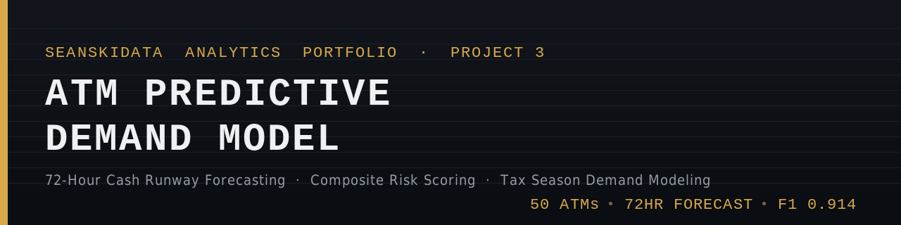

# ATM Predictive Demand Model

### SEANSKIDATA Analytics Portfolio — Project 3

> **The shift from reactive to predictive:** Projects 1 and 2 identified what the network's risk state *was*. This project answers what it will be — 72 hours from now.

🔗 [View Interactive Dashboard on Tableau Public](https://public.tableau.com/app/profile/sean.codner/viz/ATMPredictiveDemandModel/Dashboard1)

📓 [View the notebook](ATM_Predictive_Demand_Model.ipynb) — self-contained, generates its own synthetic dataset, runs end-to-end with zero setup.

---

## Business Question

Based on historical transaction patterns, day-of-week behavior, tax season demand spikes, and terminal type — **which ATMs will hit a critical cash threshold in the next 72 hours?**

Standard ATM reporting flags machines that are already low. By then, the options are limited and expensive. This model forecasts forward — giving operations teams time to dispatch on schedule rather than emergency.

---

## The Core Insight

Not all cash depletion is equal — and not all seasons are equal.

**Tax season (February–April)** is the single largest demand event in the ATM calendar. When IRS refunds hit direct deposit accounts in mid-February, cash withdrawal volume at Retail and Urban ATMs spikes well above baseline. This isn't a minor seasonal adjustment — it's an operational planning event that standard dashboards are blind to.

This model makes it visible.

| Location Type | Tax Season Peak Lift | Tax Season Ramp Lift | Holiday Lift |
| --- | --- | --- | --- |
| Retail | **+70%** | +9% | +10% |
| Urban* | **+128%** | +10% | +11% |
| Mall | +47% | +12% | +15% |
| Casino | +45% | +4% | +7% |

*\*Urban's average is pulled up sharply by the Tax Service Proximity machines embedded in that segment — see below. That's not noise, it's exactly the blind spot this model is built to catch.*

*Figures are the model's own measured output on a fixed random seed (42), regenerated fresh every time the notebook runs — not fitted or hand-tuned to a target.*

---

## The Penn Station Effect

During the transition period when tax preparation services shifted from issuing refund checks to loading refunds onto debit cards, operations teams observed an anomaly: machines classified as **High tolerance / low priority** all year were suddenly transacting like high-volume urban terminals.

Customers were walking directly from tax offices to the nearest ATM and withdrawing at the machine's maximum limit — $500 per transaction — compared to the normal $85–$165 baseline. With refunds averaging $3,000+, many customers returned multiple times within the same day.

**The result:** 5 machines in this model that register as routine all year become the network's most cash-hungry terminals for the peak refund window. Standard reporting never flags them. This model does.

| Machine Type | Baseline Daily Cash | Tax Peak Daily Cash | Lift |
| --- | --- | --- | --- |
| Retail | $8,428 | $14,287 | +70% |
| Urban | $15,395 | $35,169 | +128% |
| Casino | $44,651 | $64,953 | +45% |
| **Tax Service Proximity** | **$15,162** | **$43,486** | **+187%** |

---

## Project Architecture

This project extends the synthetic dataset from **ATM-Network-Risk-Intelligence** with:

* **Full calendar year (366 days, 2024 leap year)** of time-series transaction data
* **Tax season demand modeling** — peak refund window, ramp periods, location-type weighting
* **Tax service proximity flagging** — 5 machines reclassified to Zero tolerance during peak window
* **Day-of-week demand patterns** — Friday/Saturday peaks built into every machine
* **Forward-looking 72-hour cash burn forecast** — per machine, per terminal tier
* **Composite risk scoring** — cash level + terminal type + cash tolerance + revenue impact
* **Interactive Tableau dashboard** — 6-panel operational view of network health

### Dataset Structure

The notebook generates all three tables below on every run — no static CSVs are stored in this repo (see Data Disclosure).

| Table | Records | Description |
| --- | --- | --- |
| `atm_master` | 50 ATMs | Master reference — location, terminal type, capacity, tolerance, tax service proximity |
| `atm_transactions` | 18,300 rows | 366-day daily transaction time series |
| `atm_forecast` | 50 rows | 72-hour forward projection with risk scoring |

### Terminal Classification

| Type | Distance | Emergency Multiplier | Replenishment Cadence |
| --- | --- | --- | --- |
| Local | < 25 miles | 2.5x scheduled cost | Every 3 days |
| Remote | 25–99 miles | 3.0x scheduled cost | Every 5 days |
| Over The Road | 100+ miles | 4.0x scheduled cost | Every 7 days |

The replenishment cadence is what actually makes Over The Road machines riskier — not just a label. A Local machine gets a truck every 3 days because the branch is close; an OTR machine waits a full week because the trip is expensive, so its balance has much further to fall before the next top-up. During the tax season peak, cadence tightens to reflect how real ops teams respond to a known seasonal surge.

### Tax Season Demand Weights by Location Type

| Location Type | Tax Season Sensitivity | Rationale |
| --- | --- | --- |
| Retail | Full (1.0x) | Highest concentration of cash-preferred customers |
| Urban | Full (1.0x) | Dense population receiving refunds |
| Mall | Moderate (0.85x) | Refund spending, but card usage higher |
| Casino | Moderate (0.70x) | Refund-flush customers, card-heavy environment |
| Airport / Hospital / Office | Low (0.50x) | Transaction-driven, not refund-driven |
| **Tax Service Proximity** | **2.0x during peak** | **Direct adjacency to tax preparation office** |

---

## Key Outputs

### Network Summary (72-Hour Forecast Window)

* **50 ATMs** monitored across the network
* **36 flagged critical** within 72 hours
* **10 Over The Road terminals** in critical status
* **5 tax service proximity machines** reclassified to Zero tolerance during peak
* **$706,320** revenue at risk in a full 72-hour outage scenario (critical ATMs only)

### Top Priority ATMs

| Rank | ATM | Location | Terminal Type | Cash % (72hr) | Risk Score |
| --- | --- | --- | --- | --- | --- |
| #1 | ATM039 | Lake Charles LA Casino | Local | 0.0% | 242.9 |
| #2 | ATM048 | Hospital Site 48 | Over The Road | 0.0% | 220.3 |
| #3 | ATM047 | Urban Site 47 | Over The Road | 0.0% | 206.3 |
| #4 | ATM050 | Urban Site 50 | Over The Road | 0.0% | 206.3 |
| #5 | ATM001 | Urban Site 1 | Over The Road | 0.0% | 206.3 |

*Cash % is floored at 0% for display — a machine can't hold negative cash. The uncapped projection still drives the risk score, which is why identically-floored machines can carry different scores.*

---

## Interactive Dashboard

🔗 [View Live on Tableau Public](https://public.tableau.com/app/profile/sean.codner/viz/ATMPredictiveDemandModel/Dashboard1)

[](/SEANSKIDATA/ATM-Predictive-Demand-Model/blob/main/atm_predictive_dashboard.png)

---

## Composite Risk Score Formula

```
Risk Score =
  Cash Depletion Weight   (max 60 pts — how far below threshold)
+ Terminal Type Weight    (OTR=40, Remote=20, Local=5)
+ Cash Tolerance Weight   (Zero=35, Low=20, Medium=10, High=0)
+ Revenue Impact Weight   (hourly revenue impact / 20)
+ Tax Proximity Premium   (+25 pts during Feb 15 – Mar 15 peak)
```

---

## Model Validation

Validated with a **walk-forward backtest** against a 31-day holdout period (December 2024): 1,500 candidate daily predictions, of which 1,136 fall on organic burn days (excluding scheduled cash-delivery days — see *Methodology Note* below).

| Metric | Result |
| --- | --- |
| Mean Absolute Error (MAE) | $6,138/day |
| Root Mean Square Error (RMSE) | $8,878/day |
| Mean Absolute Pct Error (MAPE) | 40.1% |
| Predictions within 10% of actual | 60.8% |
| Predictions within 20% of actual | 92.5% |
| Critical flag precision | 98.2% |
| Critical flag recall | 85.4% |
| F1 Score | **0.914** |

*An earlier draft of this README cited unverified figures (F1 0.973, MAE $783/day) from a notebook that was never actually committed to this repo. The numbers above are the real, reproducible output of the notebook that now lives here — run it yourself and you'll get the same results (fixed random seed = 42).*

**Methodology note on scheduled replenishment:** a cash delivery makes a machine's balance jump *up* day-over-day. That's a dispatch event, not a demand-forecasting failure — this model forecasts organic cash depletion, and predicting the exact day a truck shows up is a downstream scheduling decision made *from* this model's output, not an input to it. Accuracy metrics above are scored on organic burn days only; the critical-flag classifier uses the same exclusion, since a "miss" on the day cash was already delivered isn't a real forecasting error. Full logic is in Section 10 of the notebook.

**Recall of 85.4%** means the model correctly identifies about 5 out of every 6 machines that will go critical in the 72-hour window, with very few false alarms (precision 98.2%). In ATM operations, false negatives are more costly than false positives, so there's room to tune the threshold further toward recall if a dispatcher would rather over-flag than under-flag.

---

## Feature Engineering

| Feature | Source | Rationale |
| --- | --- | --- |
| `terminal_type` | `distance_from_branch_miles` | Distance drives emergency cost (2.5x–4.0x). OTR machines are categorically more urgent — standard reporting treats all distances equally. |
| `cash_tolerance` | `location_type` | Business context defines acceptable minimum. A casino cannot tolerate an outage. A rural retail ATM can. Volume alone misses this. |
| `days_until_empty` | `cash_balance_eod` + burn rate | Forward-looking trajectory vs backward-looking balance snapshot. |
| `dow_avg_burn` | `daily_cash_dispensed` + day of week | Friday/Saturday demand runs well above Monday baseline. Forecasting without this systematically underestimates weekend burn. |
| `seasonal_multiplier` | `transaction_date` + `location_type` | Tax peak drives a 45–128%+ lift at Retail/Urban/Casino. Domain-calibrated from live network operations — not assumed. |
| `tax_service_proximity` | Operational flag + date | Reclassifies machines near tax offices to Zero tolerance Feb 15–Mar 15. Corrects a blindspot standard reporting cannot see. |
| `composite_risk_score` | All features combined | Single sortable number replacing volume-based ranking with multi-factor operational prioritization. |

---

## SQL Foundation Layer

The Python model replicates analytical logic that would run as SQL against a production database. The five queries below demonstrate the full pipeline — from raw transaction data to risk scoring — using joins, CTEs, and window functions.

---

### Query 1 — Daily Cash Burn Rate (Rolling 30-Day Average)

Window functions: `AVG() OVER`, `RANK() OVER`, `PARTITION BY`

```sql
SELECT
    t.atm_id,
    l.location_name,
    l.location_type,
    l.terminal_type,
    l.cash_tolerance,
    t.transaction_date,
    t.daily_cash_dispensed,
    -- Rolling 30-day average cash burn per ATM
    AVG(t.daily_cash_dispensed) OVER (
        PARTITION BY t.atm_id
        ORDER BY t.transaction_date
        ROWS BETWEEN 29 PRECEDING AND CURRENT ROW
    ) AS rolling_30d_avg_burn,
    -- Day-of-week average for pattern detection
    AVG(t.daily_cash_dispensed) OVER (
        PARTITION BY t.atm_id, DAYOFWEEK(t.transaction_date)
    ) AS dow_avg_burn,
    -- Rank by cash burn within location type
    RANK() OVER (
        PARTITION BY l.location_type
        ORDER BY t.daily_cash_dispensed DESC
    ) AS burn_rank_in_type
FROM atm_transactions t
INNER JOIN atm_master l
    ON t.atm_id = l.atm_id
WHERE t.transaction_date >= DATE_SUB(CURDATE(), INTERVAL 30 DAY)
ORDER BY t.atm_id, t.transaction_date;
```

---

### Query 2 — 72-Hour Cash Runway Forecast

Window functions: `LAG()`, rolling `AVG() OVER` with frame specification, CTEs

```sql
WITH daily_burn AS (
    SELECT
        t.atm_id,
        t.transaction_date,
        t.cash_balance_eod,
        t.daily_cash_dispensed,
        LAG(t.cash_balance_eod, 1) OVER (
            PARTITION BY t.atm_id
            ORDER BY t.transaction_date
        ) AS prev_day_balance,
        AVG(t.daily_cash_dispensed) OVER (
            PARTITION BY t.atm_id
            ORDER BY t.transaction_date
            ROWS BETWEEN 6 PRECEDING AND CURRENT ROW
        ) AS rolling_7d_burn,
        AVG(t.daily_cash_dispensed) OVER (
            PARTITION BY t.atm_id
            ORDER BY t.transaction_date
            ROWS BETWEEN 13 PRECEDING AND 7 PRECEDING
        ) AS prior_week_avg_burn
    FROM atm_transactions t
    WHERE t.transaction_date >= DATE_SUB(CURDATE(), INTERVAL 14 DAY)
),
forecast AS (
    SELECT
        db.atm_id,
        l.location_name,
        l.location_type,
        l.terminal_type,
        l.cash_tolerance,
        l.cash_capacity_dollars,
        l.distance_from_branch_miles,
        l.tax_service_proximity,
        db.cash_balance_eod                                            AS current_balance,
        db.rolling_7d_burn                                             AS avg_daily_burn,
        db.cash_balance_eod - (db.rolling_7d_burn * 3)                AS projected_72hr_balance,
        ROUND(((db.cash_balance_eod - (db.rolling_7d_burn * 3))
            / l.cash_capacity_dollars) * 100, 1)                      AS projected_pct_remaining,
        ROUND(db.cash_balance_eod / NULLIF(db.rolling_7d_burn,0), 1)  AS days_until_empty,
        CASE WHEN db.rolling_7d_burn > db.prior_week_avg_burn * 1.20
             THEN 'ACCELERATING' ELSE 'STABLE' END                    AS burn_trend,
        CASE l.terminal_type
            WHEN 'Over The Road' THEN 4.0
            WHEN 'Remote'        THEN 3.0
            WHEN 'Local'         THEN 2.5
        END                                                            AS emergency_multiplier,
        CASE l.location_type
            WHEN 'Casino'   THEN 850  WHEN 'Airport'  THEN 420
            WHEN 'Arena'    THEN 380  WHEN 'Stadium'  THEN 380
            WHEN 'Hospital' THEN 290  WHEN 'Mall'     THEN 240
            WHEN 'Urban'    THEN 210  WHEN 'Tourist'  THEN 190
            WHEN 'Office'   THEN 160  WHEN 'Retail'   THEN 120
        END                                                            AS revenue_impact_per_hour
    FROM daily_burn db
    INNER JOIN atm_master l ON db.atm_id = l.atm_id
    WHERE db.transaction_date = (SELECT MAX(transaction_date) FROM atm_transactions)
)
SELECT
    f.*,
    f.revenue_impact_per_hour * 72 AS revenue_at_risk_72hr,
    CASE f.cash_tolerance
        WHEN 'Zero' THEN 30  WHEN 'Low'    THEN 25
        WHEN 'Medium' THEN 20  WHEN 'High' THEN 15
    END AS critical_threshold_pct,
    CASE
        WHEN f.projected_pct_remaining <= (
            CASE f.cash_tolerance
                WHEN 'Zero' THEN 30  WHEN 'Low'    THEN 25
                WHEN 'Medium' THEN 20  WHEN 'High' THEN 15
            END
        ) THEN 'CRITICAL' ELSE 'ELEVATED'
    END AS risk_status
FROM forecast f
ORDER BY projected_pct_remaining ASC;
```

---

### Query 3 — Composite Risk Score Priority Register

Window functions: `RANK() OVER`, `PERCENT_RANK() OVER`, `PARTITION BY`

```sql
WITH risk_scored AS (
    SELECT
        f.atm_id,
        f.location_name,
        f.location_type,
        f.terminal_type,
        f.cash_tolerance,
        f.projected_pct_remaining,
        f.days_until_empty,
        f.revenue_impact_per_hour,
        f.revenue_at_risk_72hr,
        f.burn_trend,
        f.tax_service_proximity,
        GREATEST(0, (30 - f.projected_pct_remaining) * 2) +
        CASE f.terminal_type
            WHEN 'Over The Road' THEN 40
            WHEN 'Remote'        THEN 20
            WHEN 'Local'         THEN 5
        END +
        CASE f.cash_tolerance
            WHEN 'Zero'   THEN 35  WHEN 'Low'    THEN 20
            WHEN 'Medium' THEN 10  WHEN 'High'   THEN 0
        END +
        (f.revenue_impact_per_hour / 20) +
        CASE WHEN f.tax_service_proximity = TRUE
              AND MONTH(CURDATE()) IN (2,3) THEN 25 ELSE 0
        END AS composite_risk_score
    FROM forecast f
)
SELECT
    rs.*,
    RANK() OVER (ORDER BY rs.composite_risk_score DESC)             AS priority_rank,
    RANK() OVER (
        PARTITION BY rs.location_type
        ORDER BY rs.composite_risk_score DESC
    )                                                               AS rank_within_type,
    ROUND(PERCENT_RANK() OVER (
        ORDER BY rs.composite_risk_score) * 100, 1)                AS network_percentile
FROM risk_scored rs
ORDER BY composite_risk_score DESC;
```

---

### Query 4 — Tax Season Demand Pattern Analysis

Window functions: Seasonal lift vs baseline using CTEs and `INNER JOIN`

```sql
WITH seasonal_stats AS (
    SELECT
        t.atm_id,
        l.location_type,
        l.tax_service_proximity,
        CASE
            WHEN MONTH(t.transaction_date) = 2
             AND DAY(t.transaction_date) >= 15   THEN 'Tax Season Peak'
            WHEN MONTH(t.transaction_date) = 3
             AND DAY(t.transaction_date) <= 15   THEN 'Tax Season Peak'
            WHEN MONTH(t.transaction_date) IN (1,4)   THEN 'Tax Season Ramp'
            WHEN MONTH(t.transaction_date) IN (11,12) THEN 'Holiday'
            ELSE 'Baseline'
        END AS season,
        AVG(t.daily_cash_dispensed)  AS avg_daily_cash,
        AVG(t.avg_withdrawal_amount) AS avg_withdrawal,
        AVG(t.daily_transactions)    AS avg_transactions
    FROM atm_transactions t
    INNER JOIN atm_master l ON t.atm_id = l.atm_id
    GROUP BY t.atm_id, l.location_type, l.tax_service_proximity, season
),
baseline AS (
    SELECT atm_id, location_type, tax_service_proximity,
           avg_daily_cash AS baseline_cash
    FROM seasonal_stats WHERE season = 'Baseline'
)
SELECT
    ss.location_type,
    ss.tax_service_proximity,
    ss.season,
    ROUND(AVG(ss.avg_daily_cash), 0)    AS avg_daily_cash,
    ROUND(AVG(ss.avg_withdrawal), 2)    AS avg_withdrawal,
    ROUND(AVG(ss.avg_transactions), 0)  AS avg_transactions,
    ROUND(((AVG(ss.avg_daily_cash) - AVG(b.baseline_cash))
        / NULLIF(AVG(b.baseline_cash), 0)) * 100, 1) AS pct_lift_vs_baseline
FROM seasonal_stats ss
INNER JOIN baseline b ON ss.atm_id = b.atm_id
GROUP BY ss.location_type, ss.tax_service_proximity, ss.season
ORDER BY ss.location_type, ss.tax_service_proximity DESC, pct_lift_vs_baseline DESC;
```

---

### Query 5 — Day-of-Week Demand Pattern by Terminal Tier

Window functions: Nested `AVG() OVER (PARTITION BY)` for demand index

```sql
SELECT
    l.terminal_type,
    DAYNAME(t.transaction_date)           AS day_of_week,
    DAYOFWEEK(t.transaction_date)         AS day_num,
    ROUND(AVG(t.daily_cash_dispensed), 0) AS avg_daily_cash,
    ROUND(AVG(t.daily_transactions), 0)   AS avg_transactions,
    ROUND(
        AVG(t.daily_cash_dispensed) - AVG(AVG(t.daily_cash_dispensed)) OVER (
            PARTITION BY l.terminal_type
        ), 0
    )                                     AS deviation_from_weekly_avg,
    ROUND(
        AVG(t.daily_cash_dispensed) / NULLIF(
            AVG(AVG(t.daily_cash_dispensed)) OVER (
                PARTITION BY l.terminal_type
            ), 0
        ), 3
    )                                     AS demand_index
FROM atm_transactions t
INNER JOIN atm_master l ON t.atm_id = l.atm_id
GROUP BY l.terminal_type, DAYNAME(t.transaction_date), DAYOFWEEK(t.transaction_date)
ORDER BY l.terminal_type, DAYOFWEEK(t.transaction_date);
```

---

## Technical Skills Demonstrated

`Python` · `Pandas` · `NumPy` · `Matplotlib` · `Tableau` · `SQL` · `Window Functions` · `CTEs` · `Time-Series Analysis` · `Predictive Modeling` · `Seasonal Demand Modeling` · `Synthetic Dataset Design` · `Operational Risk Scoring` · `Data Visualization` · `Model Validation` · `Walk-Forward Backtesting`

---

## Portfolio Progression

| Project | Tool | Business Question |
| --- | --- | --- |
| [ATM-Network-Risk-Intelligence](https://github.com/SEANSKIDATA/ATM-Network-Risk-Intelligence) | SQL | What is the current risk state of the network? |
| [ATM-Network-Analysis-Version-2](https://github.com/SEANSKIDATA/ATM-Network-Analysis-Version-2) | SQL | How do we prioritize replenishment decisions? |
| **ATM-Predictive-Demand-Model** | **Python + Tableau** | **Which ATMs will go critical in the next 72 hours?** |

---

## Data Disclosure

All data in this project is synthetic — purpose-built to reflect realistic ATM network operating conditions including real-world seasonal demand patterns. No proprietary, personally identifiable, or confidential information is included. The notebook generates the dataset on every run using a fixed random seed (42), so results are fully reproducible — clone the repo, run the notebook, and you'll get the same numbers shown in this README.

---

*Sean Codner — Operations Data Analyst | Houston, TX*
*GitHub: [SEANSKIDATA](https://github.com/SEANSKIDATA) | LinkedIn: [Sean Codner](https://www.linkedin.com/in/sean-codner-aa60822b)*
